# Runtime-control architecture

Sandy can preserve runtime controls that were installed on the host without
linking them into its sandboxing core. An integration resolver proves the shape
of an existing installation and translates only its required resources into
Sandy's provider-neutral capability types.

```mermaid
flowchart LR
    Operator[Operator] --> Setup[sandy integrations setup]
    Setup --> HostInstall[Provider install and hook configuration]
    HostInstall --> Sources
    Preset[Built-in agent preset] --> Sources[Bounded hook sources]
    Sources --> Resolvers[Integration resolvers]
    Parent[Trusted Sandy parent] --> Resolvers
    Resolvers --> Controls[Resolved runtime controls]
    Controls --> Composition[Composition and integrity closure]
    Composition --> Core[sandy-core validation]
    Core --> Manifest[Versioned launch manifest]
    Manifest --> Bootstrap[Fresh bootstrap]
    Bootstrap --> Backend[Selected native backend]
    Backend --> Agent[Agent process tree]
    Agent --> Hook[Recognized registration]
    Hook -. optional exact endpoint .-> Host[Host runtime service]
```

The parent performs discovery before the sandbox exists. Each resolver owns one
service's installation and hook protocol, but it cannot emit native policy.
Its output is data: immutable executables, filesystem grants, write
protections, and exact local endpoints. `RuntimeControls` combines the resolved
controls once and pins every protected resource through its enclosing
writable ancestors. Core validation independently rejects a manifest that
omits that integrity closure. The bootstrap and native backend never receive
an agent or service name.

Setup is a separate, explicit macOS host-mutation plane. Both supported providers use
the same lifecycle: inspect the selected agent registration, locate an existing
executable, install only when it is absent, invoke the provider-owned
configuration command, and verify the result through the normal runtime
resolver. A verified active registration stops the lifecycle before executable
lookup, so Sandy does not rewrite a healthy installation. Ordinary launch and
doctor paths cannot enter this lifecycle.

The shared lifecycle is deliberately a closed Rust trait, not a dynamically
loaded plugin API. Setup providers supply only their installation mechanics.
Kontext delegates installation to Homebrew and therefore inherits the
operator's configured Homebrew and tap trust. Its configuration command is the
provider-wide `kontext setup`; `--agent` selects the registration Sandy verifies
afterward, not the complete scope of changes made by Kontext. Numbat downloads
one pinned public release asset, verifies its
embedded digest, and delegates registration to `numbat hook install`. Runtime
capabilities still come exclusively from the existing bounded resolvers.

A local endpoint control is independent from hook discovery. For example,
`--numbat-collector` resolves only connect authority for one IPv4 TCP port
on the local Mac and requires the otherwise blocked network policy. Linux
rejects this capability because it cannot preserve the address semantics. The
operator starts the collector and configures the agent's OTLP exporter
separately; Sandy neither launches nor health-checks it.

## Why this boundary

- It keeps ambient discovery and provider-specific formats in `sandy-cli`,
  outside deterministic core validation.
- It lets multiple controls coexist without allowing one resolver to silently
  broaden or overwrite another resolver's policy.
- It keeps the manifest and enforcement backend expressed in security
  capabilities instead of product names or raw policy fragments.
- It avoids a dynamic plugin loader in the trusted launch path. Supported
  resolvers are compiled, reviewed code with bounded inputs and explicit tests.
- It makes every policy loosening visible as a named capability with renderer
  and adjacent-negative coverage.

This design is deliberately not an arbitrary service framework. A new resolver
must define positive installation evidence, bounded parsing, exact resources,
failure behavior, and live compatibility tests. Merely finding a binary on
`PATH` is not evidence that an integration is active.

Installation evidence is provider-specific. Kontext performs its existing
bounded health preflight after finding a protocol-shaped configured command.
Numbat is not executed during discovery: Sandy recognizes its ownership marker
and the complete supported generated command or plugin shape, then validates
the declared runtime resources. “Active” for Numbat therefore means that the
registration was recognized and its exact capabilities were accepted, not that
Sandy authenticated the binary or proved a hook invocation succeeded.

Executable presence alone remains insufficient evidence during launch. It is
used only after an operator explicitly enters setup, where it determines
whether Sandy can reuse an installation or must install one. Setup always ends
by rediscovering the generated hook registration and resolving its exact
capabilities; a successful provider command without successful rediscovery is
a failure.

## Current execution identities

Kontext and Numbat hooks execute as descendants of the agent and therefore
inside the same native sandbox. Sandy can make their registration, binary,
and operator-controlled inputs readable but immutable. It cannot make a file
writable by an in-sandbox hook while denying the same write to the agent:
the backend sees both processes as one sandbox identity.

For Numbat, rule directories are read-only and recursively protected. Its
record output and sequence-state database remain writable by the entire agent
process tree, so they are telemetry and enforcement inputs with agent-tamper
risk, not an audit boundary. Their parent directories must already exist and
are protected from replacement; Sandy does not create provider state during
launch. Direct HTTP delivery from a configured hook is not enabled by this
integration because that would require external network and credential
capabilities.

User hook discovery follows the agents' supported configuration roots:
`CLAUDE_CONFIG_DIR`, `CODEX_HOME`, `OPENCODE_CONFIG_DIR`, and OpenCode's
`XDG_CONFIG_HOME` fallback. Profiles encode these as a closed set of typed
locations. Non-empty overrides must be absolute, UTF-8, and non-root; arbitrary
environment-variable path templates are not accepted. An override root must
already exist, receives the same agent-state grant as the default root, and is
rejected when it is home-wide or overlaps protected data. The known user hook
leaf is write-protected before integrations inspect it, even when it is absent.

Moving synchronous decisions into a service outside the sandbox would create a
stronger separation, but it also requires a protocol for authenticated session
identity, bounded request and response framing, availability and timeout
semantics, version negotiation, and fail-open versus fail-closed behavior. That
architecture is intentionally deferred rather than approximated through a
generic daemon or plugin interface.

The current collector endpoint is telemetry-only. A same-user process can race
to occupy the selected port, the agent can submit fabricated telemetry, and the
agent can overload the listener. Seatbelt's `localhost` filter covers the
selected port on IPv4 addresses belonging to this Mac, including non-loopback
interfaces; external IPv4 addresses, IPv6, other ports, and bind remain denied.
This capability does not authenticate either endpoint or make telemetry
complete.
